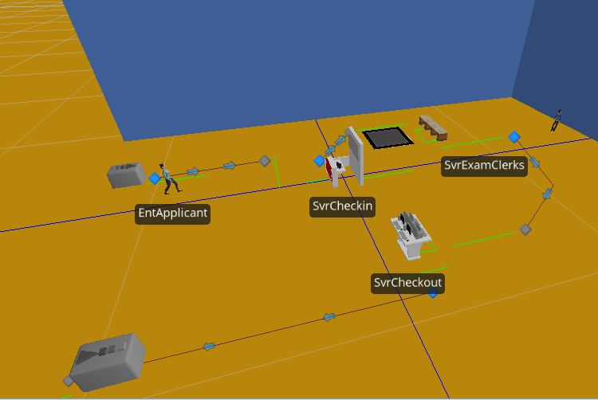

```{r, echo=FALSE, message=FALSE}
library(knitr)
#library(gplots) bibliography: references.bib
library(ggplot2)
library(randtoolbox)
library(gridExtra)
#library(plot3D)
#library(tseries)
set.seed(20275)
# My ggplot theme
myTheme <- theme(axis.ticks=element_blank(),
                 axis.title=element_text(size="10"),
                  panel.border = element_rect(color="gray", fill=NA), 
                  panel.background=element_rect(fill="#FBFBFB"), 
                  panel.grid.major.y=element_line(color="white", size=0.5), 
                  panel.grid.major.x=element_line(color="white", size=0.5),
                  plot.title=element_text(size="10"))
```

# 1) Drivers License Facility Simulation

## a) Home many 'source', 'server', 'sink' do we need to develop this model, what do those objects stand for in the real system?

* We need 1 **source**.
* 3 **servers**
* 1 **sink**

The source, named *SrcApplicantArrives* in my model, effectively represents the front door of the driver's license facility in this model. It generates the arrival events for the applicant entity.

The servers, named *SvrCheckin*, *SvrExamClerks* and *SvrCheckout* in my model, represent the check clerk, exam clerks and checkout computers, respectively.

The sink, named SnkApplicantDeparts, represents the exit door which enables the applicants to leave after they are done.

## b) Simio Model Screenshots

The screenshots of my model in Simio follow:



### SrcApplicantArrives Properties

I chose to use the exponential distribution for interarrival time since the question stated "approximately 10/hour" as opposed to "exactly"" 10/hour.


### SvrCheckin Properties

For the checkin processing time, I chose to use the normal distribution with a mean of 5 minutes and standard deviation of 1 minute. Again, my rationale was that the question write stated "approximately 5 minutes".


### SvrExamClerks Properties


### SvrCheckout Properties


## c) Run the model and obtain the performance measures...

I set the simulation to run for 8 hours based on the concept of a business day. I created an Experiment with 10 Replications which was run to generate the following performance results:


## d) Adding an optional "computerized exam kiosk"


# 2) M/M/1 Comparision

I wrote my developed queueing simulation program in R. The \(\rho\) value are generally close to the analytic solution. I didn't figure out how get a good number in queue value from my R program, but the analytic solution and Simio are quite close. For W, the expected system time, again the analytic solution and Simio are quite close... I'm not sure why my R prog is lower. Simio and my R program were run over 1000 customers, time was dependent on completion of all 1000 customers.

```{r, echo=FALSE}
dfCompare <- data.frame(simType=c("Analytic", "R Prog", "Simio"), 
                        p=c(0.7, 0.6826126, 0.697052), 
                        Lq=c(1.633333, NA, 1.62117), 
                        W=c(23.33333, 18.13304, 23.4261))
kable(dfCompare)
```

```{r, code=readLines("./Dittenhafer-Hw06-2.R"), eval=FALSE, highlight=TRUE}
```


# DES 6.1

First some queue math:

```{r}
lambda <- 1 / 4
mu <- 1 / 3
rho <- lambda / mu
rho

Lq <- (rho^2) / (1 - rho)
Lq

Wq <- rho / (mu * (1 - rho))
Wq

costOfMechanicDelayPerHour <- 15 * Lq
costOfMechanicDelayPerHour
```

Based on a average cost per hour of `r costOfMechanicDelayPerHour` for `r Lq` delayed mechanics, it appears advisable to have a second tool-crib attendant (at $10/hour).

# DES 6.2

First some math:

\[W_q = \frac{\lambda(1/\mu^2 + 1/\mu^2)}{2(1-\rho)}\]

\[3 = \frac{\lambda(1/(1.5)^2 + 1/(1.5)^2)}{2(1-(\lambda / 1.5))}\]

\[3 = \frac{\lambda(1/2.25 + 1/2.25)}{2(1-(\lambda / 1.5))}\]

\[3 = \frac{\lambda(0.444 + 0.444)}{2-(1.33\lambda))}\]

\[3(2-(1.33\lambda))) = \lambda(0.888)\]

\[6-4\lambda = \lambda(0.888)\]

\[\frac{6}{\lambda} - \frac{4\lambda}{\lambda} = 0.888\]

\[\frac{6}{\lambda} - 4 = 0.888\]

\[\frac{6}{\lambda} = 4.888\]

\[\lambda = \frac{6}{4.888} \approx 1.227\]

```{r}
lambda <- 1.227
mu <- 1.5
rho <- lambda / mu

Wq <- (lambda * (1 / mu^2 + 1 / mu^2)) / (2 * (1 - rho))
Wq

```